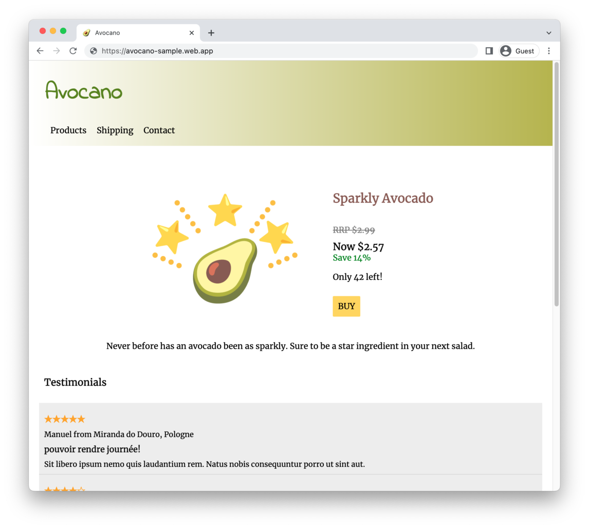

# 🥑 Avocano - a fake dropship sample website

Avocano is a sample dropship/fake product website, combining: 
 
 * Firebase Hosting front end, written with [Lit](https://lit.dev/).
 * Cloud Run API backend, written with [Django REST Framework](https://www.django-rest-framework.org/),
 * Cloud SQL database, with migrations applied through Cloud Run Jobs.
 * Terraform and Cloud Build provisioning. 

## Launch

Launch this application using the Cloud Shell:

## Use this application

Read more about how to use this application in the [docs](docs/README.md).

## Code of Conduct

Please see the [code of conduct](CODE_OF_CONDUCT.md)

## Contributions

Please see the [contributing guidelines](CONTRIBUTING.md)

## License

This sample is licensed under Apache 2.0. Full license text is available in [LICENSE](LICENSE).

Demo images used are part of [Emoji Kitchen](https://emojipedia.org/emoji-kitchen/), mashups of Google's emoji set. 
